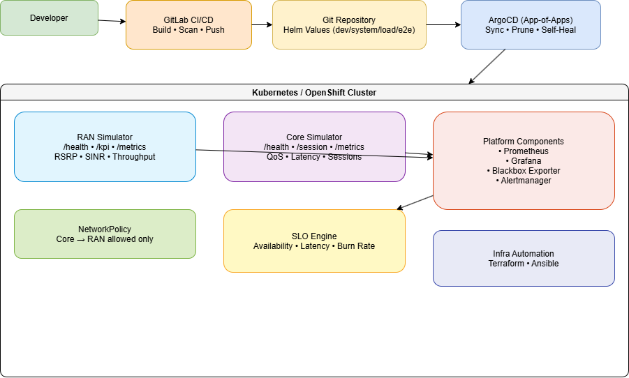
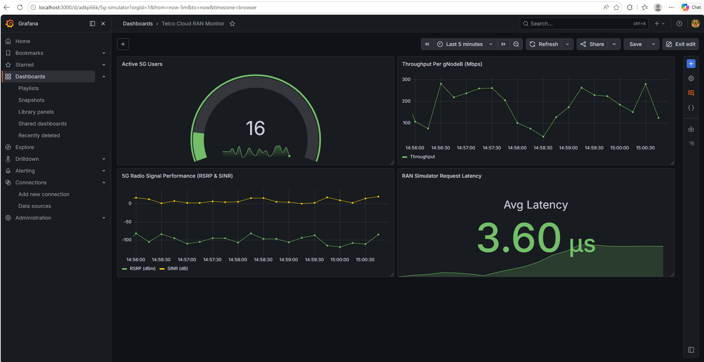
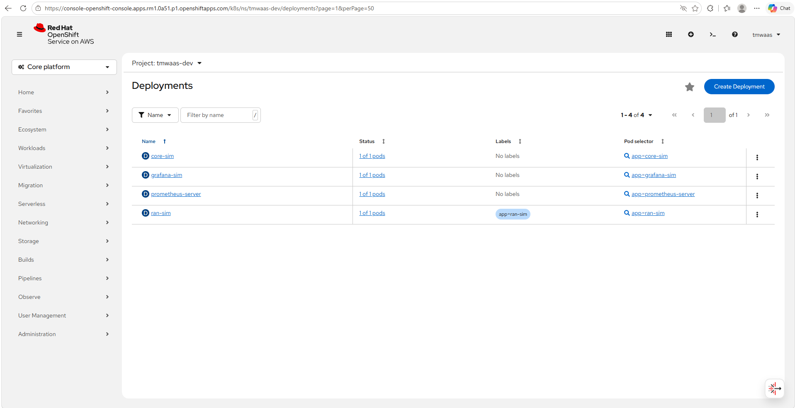

# 📡 Telco Cloud Project – 5G DevOps, GitOps, Observability & Automation Platform

[]()
[]()
[]()
[]()
[]()
[]()

A complete cloud‑native telecom platform simulating 5G RAN and 5G Core workloads deployed on **Red Hat OpenShift**, featuring:
* Helm + Kubernetes / OpenShift Core
* GitLab CI/CD
* ArgoCD GitOps (App-of-Apps pattern)
* Prometheus + Grafana Observability Stack
* Terraform + Ansible automation
* Security‑focused enterprise workload deployment

---

# 🔥 Key Features Overview

| Capability | Status |
|-----------|--------|
| RAN KPI Simulator (FastAPI) | ✅ |
| Core Session Simulator | ✅ |
| Fully automated GitLab CI pipeline | ✅ |
| GitOps deployment with ArgoCD | ✅ |
| Multi-environment Helm values | ✅ |
| Prometheus metrics + Grafana dashboards | ✅ |
| SLO/SLI alerting | ✅ |
| Terraform namespace provisioning | ✅ |
| Ansible config automation | ✅ |
| NetworkPolicy security | ✅ |

---

# 🧬 Architecture Diagram

****

```
Developer → GitLab CI/CD → Build/Scan/Push
                   ↓
            GitOps: Helm values updated
                   ↓
      ┌───────────────────────────────┐
      │        ArgoCD Root App        │
      └───────────────────────────────┘
                   ↓
 App-of-Apps → ran-sim / core-sim / platform stack
                   ↓
  Kubernetes / OpenShift Deployments + Services
                   ↓
Observability → Prometheus + Grafana + Blackbox + Alerts
```

---

# 📡 RAN Simulator (FastAPI)

Simulates radio KPIs:
- RSRP  
- SINR  
- Throughput  
- Latency  

Endpoints:
```
/health
/kpi
/metrics
```

---

# 🧬 Core Simulator (FastAPI)

Simulates core network session flow:
- Session counters  
- QoS distribution  
- p95 latency  
- Active sessions  

Endpoints:
```
/health
/session
/session/end
/metrics
```

---

# 🚀 GitLab CI/CD Pipeline

Pipeline stages:
```
Lint → Build → Scan → Push → GitOps Deploy → Smoke Test → Parse Test Results
```

Includes:
- Ruff linting  
- Docker build  
- Trivy & optional JFrog scanning  
- Push to GitLab registry  
- Helm values automation via yq  
- JUnit parsing  

---

# 🔁 GitOps with ArgoCD

ArgoCD automates:
- Multi-environment workloads  
- Self-healing deployments  
- Drift correction  
- Namespace auto-creation  

Directories:
```
gitops/argocd/root-app.yaml
gitops/argocd/apps/app-ran-sim.yaml
gitops/argocd/apps/app-core-sim.yaml
gitops/argocd/apps/app-platform.yaml
```

---

# 📦 Helm Charts

Each component includes:
```
deployment.yaml (probes, RollingUpdate, security)
service.yaml (named port: http)
values-dev.yaml
values-system.yaml
values-load.yaml
values-e2e.yaml
```

All charts tested and ArgoCD‑compatible.

---

# 📊 Observability & SLOs

* **Prometheus Metrics Engine**: Emitted by both Telecom microservices, custom scrapes configured via Prometheus ConfigMaps.
* **Synthetic Monitoring**: End-to-end endpoint checks via Prometheus BlackboxExporter.
* **Grafana Enterprise Dashboards**:
  * **`Telco Cloud RAN Monitor`**: A production-grade NOC dashboard visualizing live 3GPP Radio Metrics (**RSRP (dBm)** & **SINR (dB)**), dynamic **Throughput per gNodeB (Mbps)**, **Active 5G Users**, and microsecond-level **RAN Simulator Request Latency**.
  * **`Core Session Dashboard`**: Monitoring subscriber registration session flows, active call states, and network performance.
* **SLO & Alerting Policies**:
  * Availability error budget burn alerts.
  * p95 session and request latency thresholds.    

---

### 📊 Production-Grade Telco Cloud RAN Monitor

Here is the finalized visual performance telemetry captured live from our active gNodeB simulation workloads:

<p align="center">
  
</p>

---

# 🔐 Security

| Control | Status |
|---------|--------|
| PodSecurityContext | ✅ |
| ContainerSecurityContext | ✅ |
| NetworkPolicy | Restricts core → ran traffic |
| Vault secret placeholder | Included |

---

# ⚙ Infrastructure Automation

### Terraform
```
infra/terraform/providers.tf
infra/terraform/namespaces.tf
```

### Ansible
```
infra/ansible/telco-config-playbook.yaml
```

---

🔴 Red Hat OpenShift Deployment Architecture

The production environment is built specifically for **Red Hat OpenShift** infrastructure, adhering to enterprise security constraints:
* **Security Context Constraints (SCC)**: Workloads configured to run strictly without root privileges (`runAsNonRoot: true`), fully compliant with OpenShift's default restricted execution policies.
* **Service Mesh & Route Management**: Internal components integrated with cluster monitoring tools, allowing secure PromQL collection across namespaces.
* **Resource Optimization**: Live profiling indicates minimal-footprint simulation executing gracefully under standard tenant resource quotas.

---

### 🌐 Live Cluster Deployments on Red Hat OpenShift

Below is the verified running state of our 5G simulation stack microservices inside the OpenShift environment:

<p align="center">
  
</p>

---

# 🧪 Testing

- Load testing via **k6**
- Smoke tests executed by CI
- JUnit test parsing using `parse_test_results.py`

---

# 🛠 Deployment Instructions

### 1. Local Test
```bash
docker build -t ran-sim-test apps/ran-sim
docker run -p 8000:8000 ran-sim-test
curl localhost:8000/health
```

### 2. Deploy with ArgoCD
```bash
kubectl apply -f gitops/argocd/root-app.yaml
```

ArgoCD deploys:
- ran-sim  
- core-sim  
- platform stack  
- monitoring + SLO rules  

### 3. Enterprise OpenShift Deployment

To target a Red Hat OpenShift cluster using native CLI configurations:
```bash
# Login to your OpenShift cluster
oc login --token=<YOUR_TOKEN> --server=<YOUR_CLUSTER_URL>

# Apply the GitOps Root Application
oc apply -f gitops/argocd/root-app.yaml

# Verify OpenShift Pod Statuses
oc get pods <your-allocated-namespace>
```

---

# 👨‍💼 Author

**Thomas Waas**  
Cloud-Native Telecom & 5G DevOps Engineer 
